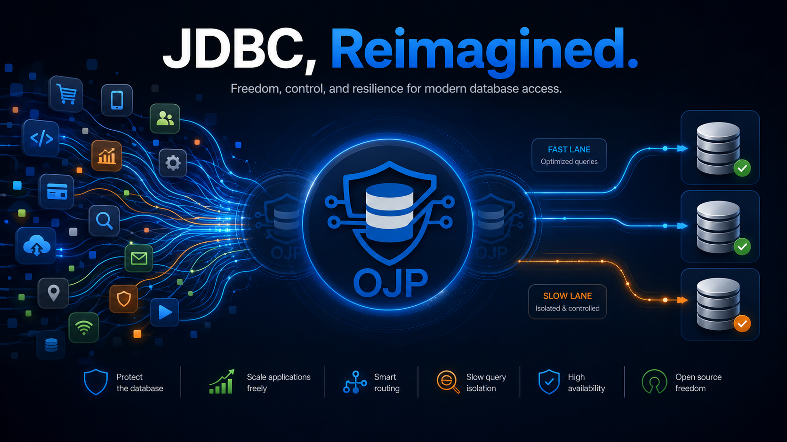

# Open J Proxy

 [](https://github.com/Open-J-Proxy/ojp/actions/workflows/main.yml) [](https://github.com/Open-J-Proxy/ojp-framework-integration/actions/workflows/main.yml) [](https://raw.githubusercontent.com/Open-J-Proxy/ojp/master/LICENSE)

[](https:&#x2F;&#x2F;www.meterian.com/report/gh/Open-J-Proxy/ojp) [](https:&#x2F;&#x2F;www.meterian.com/report/gh/Open-J-Proxy/ojp)

Website 👉 [openjproxy.com](https://openjproxy.com) 

Follow us on LinkedIn 👉 [Open J Proxy](https://www.linkedin.com/company/open-j-proxy) 

[](https://discord.gg/J5DdHpaUzu)

---

**A smart, open-source database control plane** — delivered as a Type 3 JDBC driver and a Layer 7 proxy server. OJP sits between your applications and your relational databases and provides backpressure, rich observability, client-side reactive throttling, slow-vs-fast query segregation, and load balancing / failover — all behind a standard JDBC API and with a roadmap for non-Java clients.

_"The only open-source JDBC Type 3 driver globally, this project introduces a transparent Quality-of-Service layer that decouples application performance from database bottlenecks. It's a must-try for any team struggling with data access contention, offering easy-to-implement back-pressure and pooling management." (Bruno Bossola - Java Champion and CTO @ Meterian.io)_  

---

## Star History

<a href="https://star-history.com/#Open-J-Proxy/ojp&Timeline">
  <picture>
    <source media="(prefers-color-scheme: dark)" srcset="https://api.star-history.com/svg?repos=Open-J-Proxy/ojp&type=Timeline&theme=dark" />
    <source media="(prefers-color-scheme: light)" srcset="https://api.star-history.com/svg?repos=Open-J-Proxy/ojp&type=Timeline" />
    
  </picture>
</a>


[](https://buymeacoffee.com/wqoejbve8z)

---

## Value Proposition

OJP is a **smart database control plane** for relational databases — more than a connection-pool proxy, it is a programmable layer between your applications and your databases that delivers:

- **Backpressure & connection-storm protection** — a global, OJP-managed pool fronts the database so elastic fleets cannot exhaust connections.
- **Client-side reactive throttling** — when the server is under pressure, clients back off automatically and recover on their own.
- **Slow vs fast query segregation (SQS)** — keeps long analytical queries from starving short OLTP traffic. See [Mixed OLTP + OLAP workloads](#mixed-oltp--olap-workloads-enable-slow-query-segregation) below.
- **Rich observability** — OpenTelemetry traces and Prometheus metrics for pools, admission, classification and throttling. See [Telemetry and Observability](documents/telemetry/README.md).
- **Load balancing & failover in the driver** — multinode URLs (`jdbc:ojp[host1:port1,host2:port2]_...`) with load-aware routing and session stickiness. See [Multinode Configuration](documents/multinode/README.md).
- **Seamless Java integration** — standard JDBC 4.2, Spring Boot starter, Quarkus and Micronaut guides; no application rewrite.
- **Path to a universal database control plane** — the gRPC protocol is language-neutral, so non-Java clients (Python, Node, Go, …) can join the same plane. See the [multi-language client spec](documents/multi-language-client-spec/).

Tested support for databases: **PostgreSQL, MySQL, MariaDB, Oracle, SQL Server, DB2, and H2**. Also compatible in principle with any database that provides a JDBC driver.

---
## Requirements

- **OJP JDBC Driver**: Java 11 or higher
- **OJP Server**: Java 21 or higher

---
## Quick Start

Get OJP running in under 5 minutes:

### 1. Start OJP Server (Docker)

> **⚠️ Important for v0.4.0-beta and later:** JDBC drivers must be downloaded and mounted. See [Chapter 4: Database Drivers](documents/ebook/part2-chapter4-database-drivers.md) for details.

```bash
# Download drivers first
mkdir -p ojp-libs
cd ojp-server
bash download-drivers.sh ../ojp-libs
cd ..

# Run with drivers mounted
docker run --rm -d \
  --network host \
  -v $(pwd)/ojp-libs:/opt/ojp/ojp-libs \
  rrobetti/ojp:0.4.16-beta
```

**Alternative: Runnable JAR (No Docker)**

```bash
# Download OJP Server JAR from Maven Central
wget https://repo1.maven.org/maven2/org/openjproxy/ojp-server/0.4.16-beta/ojp-server-0.4.16-beta-shaded.jar
chmod +x ojp-server-0.4.16-beta-shaded.jar

# Download open source JDBC drivers
curl -LO https://raw.githubusercontent.com/Open-J-Proxy/ojp/main/ojp-server/download-drivers.sh
bash download-drivers.sh  # Downloads H2, PostgreSQL, MySQL, MariaDB to ojp-libs/
java -Duser.timezone=UTC -jar ojp-server-0.4.16-beta-shaded.jar
```

📖 See [Executable JAR Setup Guide](documents/runnable-jar/README.md) for details.

### 2. Add OJP JDBC Driver to your project
```xml
<dependency>
    <groupId>org.openjproxy</groupId>
    <artifactId>ojp-jdbc-driver</artifactId>
    <version>0.4.16-beta</version>
</dependency>
```

### 3. Update your JDBC URL
Replace your existing connection URL by prefixing with `ojp[host:port]_`:

```java
// Before (PostgreSQL example)
"jdbc:postgresql://user@localhost/mydb"

// After  
"jdbc:ojp[localhost:1059]_postgresql://user@localhost/mydb"

// Oracle example
"jdbc:ojp[localhost:1059]_oracle:thin:@localhost:1521/XEPDB1"

// SQL Server example
"jdbc:ojp[localhost:1059]_sqlserver://localhost:1433;databaseName=mydb"
```
Use the ojp driver: `org.openjproxy.jdbc.Driver`

That's it! Your application now uses intelligent connection pooling through OJP.

**Note**: For detailed driver setup including proprietary databases (Oracle, SQL Server, DB2), see [Chapter 4: Database Drivers](documents/ebook/part2-chapter4-database-drivers.md).

---

## Mixed OLTP + OLAP workloads — Enable Slow Query Segregation

If the same database serves **both** short OLTP queries **and** long reporting/OLAP queries, enable **Slow Query Segregation (SQS)** on the OJP server:

```bash
-Dojp.server.slowQuerySegregation.enabled=true
```

Or via environment variable: `OJP_SERVER_SLOWQUERYSEGREGATION_ENABLED=true`.

That single flag is enough — defaults are tuned for typical mixed workloads. For tuning options (slow-slot percentage, classification mode, thresholds), see [Slow Query Segregation](documents/designs/SLOW_QUERY_SEGREGATION.md) and the [server configuration reference](documents/configuration/ojp-server-configuration.md#slow-query-segregation-settings). For pure OLTP-only or pure OLAP-only deployments, leave SQS disabled (the default).

---

## Alternative Setup: Executable JAR (No Docker)

If Docker is not available in your environment, you can run OJP Server as a standalone JAR file downloaded directly from Maven Central — no source code or build tools required:

📖 **[Executable JAR Setup Guide](documents/runnable-jar/README.md)** - Complete instructions for downloading from Maven Central and running OJP Server as a standalone executable JAR with all dependencies included.

> **For contributors:** If you need to build the JAR from source, see [Building from Source](documents/runnable-jar/BUILDING_FROM_SOURCE.md).

---

## Documentation
### High Level Solution



* The OJP JDBC driver is used as a replacement for the native JDBC driver(s) previously used with minimal change, the only change required being prefixing the connection URL with `ojp_`. 
* **Open Source**: OJP is an open-source project that is free to use, modify, and distribute.
* **Smart database control plane**: The OJP server is deployed as an independent service that sits between application(s) and their relational database(s), centrally enforcing connection limits, admission control, throttling and quality-of-service policy.
* **Backpressure & connection-storm protection**: real database connections are allocated only when needed and capped globally, so elastic application fleets cannot overwhelm the database.
* **Client-side reactive throttling**: when the server is under pressure, clients are signaled to throttle themselves and recover automatically — preventing thread pile-ups in the application.
* **Slow vs fast query segregation**: optional lane-based segregation of OLTP and OLAP traffic on the same database — see [Mixed OLTP + OLAP workloads](#mixed-oltp--olap-workloads-enable-slow-query-segregation).
* **Rich observability**: built-in OpenTelemetry tracing and Prometheus metrics expose pool, admission, classification and throttling behaviour. See [Telemetry and Observability](documents/telemetry/README.md).
* **Load balancing & failover in the driver**: the OJP JDBC driver supports multinode URLs (`jdbc:ojp[host1:port1,host2:port2]_...`) with load-aware routing, session stickiness, and automatic failover. See [Multinode Configuration](documents/multinode/README.md).
* **Elastic scalability**: client applications can scale elastically without increasing the pressure on the database.
* **gRPC protocol** between driver and server provides multiplexed, low-latency communication — and is language-neutral, opening the door to non-Java clients (see [multi-language client spec](documents/multi-language-client-spec/)).
* **Multiple relational databases**: in theory any relational database that provides a JDBC driver implementation.
* **Simple setup**: just add the OJP library to the classpath and prefix the connection URL (e.g. `jdbc:ojp[host:port]_h2:~/test`).
* **Drop-In External Libraries**: Add proprietary JDBC drivers (Oracle, SQL Server, DB2) and additional libraries (e.g., Oracle UCP) without recompiling - see [Drop-In Driver Documentation](documents/configuration/DRIVERS_AND_LIBS.md). Simply place JARs in the `ojp-libs` directory.
* **SQL Query Enhancement**: ⚠️ **EXPERIMENTAL (NOT RECOMMENDED)** - Optional SQL enhancer with Apache Calcite for query optimization. **Disabled by default.** Has known limitations with traditional JDBC databases (PostgreSQL, MySQL, Oracle, SQL Server). See [configuration documentation](documents/configuration/ojp-server-configuration.md#sql-enhancer-and-schema-loader-settings) for details.

### Further documents
- [Docker Deployment Guide](documents/configuration/DOCKER_DEPLOYMENT.md) - Comprehensive guide for deploying OJP Server with Docker, including JVM parameter configuration, production examples, and troubleshooting.
- [Drop-In External Libraries Support](documents/configuration/DRIVERS_AND_LIBS.md) - Add proprietary database drivers and libraries (Oracle JDBC, Oracle UCP, SQL Server, DB2) without recompiling.
- [SSL/TLS Certificate Configuration Guide](documents/configuration/ssl-tls-certificate-placeholders.md) - Configure SSL/TLS certificates with server-side property placeholders for PostgreSQL, MySQL, Oracle, SQL Server, and DB2.
- [Architectural decision records (ADRs)](documents/ADRs) - Technical decisions and rationale behind OJP's architecture.
- [Get started: Spring Boot, Quarkus and Micronaut](documents/java-frameworks/README.md) - Framework-specific integration guides and examples.
- [Understanding OJP Service Provider Interfaces (SPIs)](documents/Understanding-OJP-SPIs.md) - Guide for Java developers on implementing custom connection pool providers.
- [Connection Pool Configuration](documents/configuration/ojp-jdbc-configuration.md) - OJP JDBC driver setup, connection pool settings, and environment-specific configuration (ojp-dev.properties, ojp-staging.properties, ojp-prod.properties).
- [OJP Server Configuration](documents/configuration/ojp-server-configuration.md) - Server startup options, runtime configuration, and SQL enhancer with schema loading.
- [Multinode Configuration](documents/multinode/README.md) - High availability and load balancing with multiple OJP servers.
- [Slow query segregation feature](documents/designs/SLOW_QUERY_SEGREGATION.md) - Strongly recommended for mixed fast+slow query workloads; usually not needed for pure OLTP or pure OLAP workloads.
- [Telemetry and Observability](documents/telemetry/README.md) - OpenTelemetry integration and monitoring setup.
- [OJP Components](documents/OJPComponents.md) - Core modules that define OJP’s architecture, including the server, JDBC driver, and shared gRPC contracts.
- [Targeted Problem and Solution](documents/targeted-problem/README.md) - Explanation of the problem OJP solves and how it addresses it.
- [BigDecimal Wire Format](documents/protocol/BIGDECIMAL_WIRE_FORMAT.md) - Protocol specification for language-neutral BigDecimal serialization.

---

## Vision

Provide a free and open-source **universal database control plane** for relational databases — a single, programmable layer where teams can enforce connection limits, backpressure, throttling, slow/fast segregation, and observability across many databases and (in time) many client languages. The project is designed to help microservices, event-driven, and serverless architectures scale elastically without sacrificing database stability, while giving operators a clear view into what the data tier is doing.

---

## Roadmap

See [ROADMAP.md](ROADMAP.md) for planned releases and upcoming features, including the path to 1.0.0 (production ready).

---

## Contributing & Developer Guide

Welcome to OJP! We appreciate your interest in contributing. This guide will help you get started with development.
- [OJP Contributor Recognition Program](documents/contributor-badges/contributor-recognition-program.md) - OJP Contributor Recognition rewards program and badges recognize more than code contributions, check it out!
- [Source code developer setup and local testing](documents/code-contributions/setup_and_testing_ojp_source.md) - Outlines how to get started building OJP source code locally and running tests.

---

## Partners

| Logo                                                                                                                                                                                                                        | Description                                                                                                                                | Website |
|-----------------------------------------------------------------------------------------------------------------------------------------------------------------------------------------------------------------------------|--------------------------------------------------------------------------------------------------------------------------------------------|---------|
| <a href="https://www.linkedin.com/in/devsjava/" target="_blank" rel="noopener"></a>                       | Brazilian Java User Group connecting developers for knowledge sharing and professional networking.                                         | [linkedin.com/in/devsjava](https://www.linkedin.com/in/devsjava/) |
| <a href="https://github.com/switcherapi" target="_blank" rel="noopener"></a> | Feature management platform for managing features at scale with performance focus.                                                         | [github.com/switcherapi](https://github.com/switcherapi) |
| <a href="https://www.meterian.io/" target="_blank" rel="noopener"></a>                                               | Application security platform that identifies vulnerabilities across open-source dependencies and application code.                        | [meterian.io](https://www.meterian.io/) |
| <a href="https://www.youtube.com/@cbrjar" target="_blank" rel="noopener"></a>                                                                | YouTube channel for Java developers covering frameworks, containers, and modern JVM topics.                                                | [youtube.com/@cbrjar](https://www.youtube.com/@cbrjar) |
| <a href="https://javachallengers.com/career-diagnosis" target="_blank" rel="noopener"></a>                                   | Helps developers go beyond coding, mastering Java fundamentals, building career confidence, and preparing for international opportunities. | [javachallengers.com](https://javachallengers.com/career-diagnosis) |
| <a href="https://omnifish.ee" target="_blank" rel="noopener"></a>                                                                             | The team behind Eclipse GlassFish, delivering reliable opensource solutions with enterprise support.                                       | [omnifish.ee](https://omnifish.ee/) |
