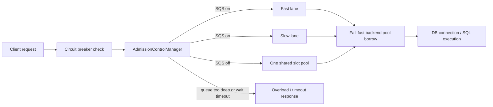

# Request Admission, Timeouts, and Backpressure (Current Behavior)

This short note reflects the latest merged work around request admission and overload handling, especially PR **#520** and PR **#519**.

## In simple words

OJP now puts an **admission gate** in front of pooled database work.

- A request must get a **slot** before it can use the backend pool.
- If too many requests are already waiting, OJP **rejects early** instead of letting the queue grow forever.
- If slow query segregation is enabled, OJP uses **two lanes**:
  - **fast lane** for normal queries
  - **slow lane** for queries that learned to be slow over time
- After a request passes the gate, backend pool borrow is **fail-fast**. The main waiting happens at the admission gate, not deep inside the pool.

## How admission works now

### 1. Admission is always in front of pooled work

For pooled datasources, OJP creates one `AdmissionControlManager` per datasource.

- **Slow query segregation OFF**: all slots are treated as one shared fast pool.
- **Slow query segregation ON**: slots are split into fast and slow lanes.

The total slot count follows the datasource pool size (or XA transaction slot count for XA).

### 2. Slow/fast classification is learned

When segregation is enabled, OJP tracks SQL execution times by statement hash.

- A query becomes **slow** when its rolling average is at least **2x** the global average.
- Slow and fast lanes stay isolated, but idle slots can be borrowed after the configured idle timeout.

### 3. Backpressure happens before pool borrow

The slot gate is the main backpressure layer.

- If the wait queue is already too deep, OJP fails fast.
- If a request waits longer than its slot timeout, OJP returns overload/timeout.
- If a request gets a slot, OJP then tries to borrow from the backend pool.
- That pool borrow is intentionally **fail-fast**, so hidden long waits do not move inside Hikari/XA pool code.

### 4. Lazy session creation also uses the same gate

For pooled session creation, OJP reuses the same admission semaphores.

- If the current thread already holds a statement slot, OJP can convert it into a session permit.
- Otherwise it acquires a session permit from the same admission manager.
- The permit is released when the session ends.

## Main settings

| Setting | What it controls now |
|---|---|
| `ojp.server.slowQuerySegregation.enabled` | Turns fast/slow lane mode on or off |
| `ojp.server.slowQuerySegregation.slowSlotPercentage` | Share of slots reserved for the slow lane |
| `ojp.server.slowQuerySegregation.idleTimeout` | How long one lane must stay idle before the other lane can borrow its slots |
| `ojp.server.slowQuerySegregation.fastSlotTimeout` | Fast-lane wait budget when slow query segregation is enabled |
| `ojp.server.slowQuerySegregation.slowSlotTimeout` | Slow-lane wait budget when slow query segregation is enabled |
| `ojp.server.admissionControl.maxQueueDepth` | Max number of waiters before OJP rejects new work immediately (`0` = auto, `totalSlots x 2` per semaphore) |
| `ojp.connection.pool.connectionTimeout` | Admission wait budget when slow query segregation is off; also the fallback admission budget for pooled non-XA setup |
| `ojp.xa.connection.pool.connectionTimeout` | Same idea as above, but for XA pooled admission |

## Practical mental model

Think of OJP like this:

1. **Gate requests first**
2. **Reject overload early**
3. **Keep fast work away from slow work when needed**
4. **Do not let the backend pool become the hidden waiting room**

## Related docs

- [OJP Server Configuration](../configuration/ojp-server-configuration.md)
- [Slow Query Segregation](../designs/SLOW_QUERY_SEGREGATION.md)
- [Always-On Admission Control Semaphore Analysis](./ALWAYS_ON_ADMISSION_CONTROL_SEMAPHORE_ANALYSIS.md)
