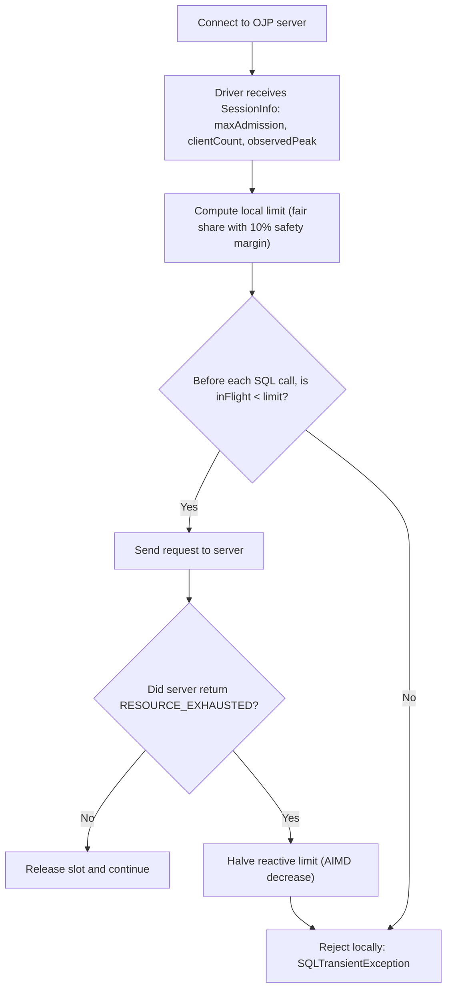

# OJP Client-Side Throttling — Design Notes

## Why Client-Side Throttling?

When the OJP server's admission control is under pressure — specifically when requests
wait longer than the configured `connectionTimeout` and result in an **admission timeout**
— the server is already struggling. Every new request that arrives at that moment makes
the situation worse: it extends the wait queue, competes with requests already waiting,
and can cascade into more timeouts.

Client-side throttling prevents this from happening in the first place. Instead of letting
every client thread fire requests until the server starts rejecting them, each client
limits its own concurrent in-flight count to its fair share of the server's real capacity.
Shorter queues mean lower admission-wait latency, fewer timeouts, and no thundering-herd
spikes when load increases suddenly.

**Without client throttling (problem):** 80 threads across 8 app servers hit one OJP node
at once (example node configured with a 40-slot pool) → the pool is overwhelmed → many requests queue or timeout → the
server's situation gets worse, not better.

**With client throttling (solution):** each app server caps itself at `ceil(40/8)×1×0.9 ≈ 4`
concurrent requests → at most ~32 in-flight across the cluster → the pool stays within
capacity, admission timeouts stop, and throughput is maintained.

## Simple Flow (with examples)



**Example 1 (normal):**
- Server says `maxAdmission=40`, `clientCount=8`, `numServers=2`
- Limit = `ceil(40/8) × 2 × 0.9 = 9`
- Each client sends up to 9 concurrent requests; pressure stays controlled.

**Example 2 (overload signal):**
- A request gets `RESOURCE_EXHAUSTED` from server.
- Driver halves reactive limit (for example `40 → 20`).
- Next bursts are rejected in the client first, so fewer requests hit an overloaded server.

---

## Glossary

| Acronym / Term | Full name | Meaning in this document |
|---|---|---|
| **AIMD** | Additive Increase, Multiplicative Decrease | Congestion-control algorithm borrowed from TCP. When overload is detected (admission timeout), the limit drops sharply (multiplicative decrease). As successful operations accumulate, the limit grows back one step at a time (additive increase). Prevents thundering-herd bursts while recovering capacity gradually. |
| **CAS** | Compare-And-Swap | A CPU-level atomic instruction used by `AtomicInteger.incrementAndGet()`. Reads a value, computes the new value, and writes it back only if the original value is unchanged — all in one atomic step. Allows safe concurrent updates without locks. |
| **connHash** | Connection hash | A hash of the JDBC URL + username + password that uniquely identifies a datasource/credential pair. All JDBC connections with the same URL and credentials share the same `connHash`. |
| **clientUUID** | Client universally unique identifier | A random identifier generated once per JVM process by the OJP driver. Used by the server to count distinct application instances (JVMs) connected to a given `connHash`, as opposed to counting raw connection objects. |
| **JDBC** | Java Database Connectivity | The standard Java API for connecting to relational databases. OJP implements this API so applications can use it as a drop-in driver. |
| **JVM** | Java Virtual Machine | The runtime that executes Java bytecode. One JVM = one application process. Each JVM has one `clientUUID`. |
| **OLTP** | Online Transaction Processing | Database workloads characterised by many short, fast queries (select/insert/update), as opposed to long analytical queries. The default SQS parameters are tuned for OLTP. |
| **OJP** | Open J Proxy | This project. A JDBC Type 3 proxy driver that forwards JDBC calls over gRPC to a central server which owns the real database connection pools. |
| **SQS** | Slow Query Segregation | An OJP server feature that routes long-running SQL queries to a dedicated "slow lane" pool, preventing them from starving fast queries waiting for connection slots. |
| **TCP CWND** | TCP Congestion Window | TCP's built-in mechanism for avoiding network overload: grow the send window aggressively until packet loss occurs (slow start), then halve it (multiplicative decrease), then grow by one segment per round-trip (additive increase). `observedPeak` follows the same pattern applied to OJP admission slots instead of bytes. |
| **gRPC** | Google Remote Procedure Call | The RPC framework used for communication between the OJP driver and server. Runs over HTTP/2. |

---

## Current Design: Three Configurable Modes

All three modes use the same `AtomicInteger` fail-fast counter in the driver (no blocking,
no Semaphore) and AIMD step-limited increase. They differ only in where the limit comes from.

### Protocol additions to `SessionInfo`

```proto
int32 clientCount   = 9;   // distinct JVMs (clientUUID) connected to this connHash on this node
int32 maxAdmission  = 10;  // per-node HikariCP pool size (confirmed: SlotManager.totalSlots = actualPoolSize)
int32 observedPeak  = 11;  // adaptive effective capacity (0 = no failure observed yet)
```

`clusterHealth` already carries the UP/DOWN node list; `numOjpServers` is derived from it.

---

### Proactive Mode

Throttles from the very first `connect()` using the fair-share formula:

```java
int effectiveAdmission = (observedPeak > 0) ? observedPeak : maxAdmission;
int rawLimit = (int) Math.ceil((double) effectiveAdmission / clientCount) * numOjpServers;
int limit = Math.max(1, (int)(rawLimit * 0.9));  // 10% safety headroom
```

**Why ceiling division + 10% headroom:**
Floor division permanently wastes capacity (`floor(20/7)=2` leaves 6 slots idle).
Ceiling slightly over-allocates (`ceil(20/7)=3`, total=21 vs capacity=20), so the 10%
reduction absorbs one stale `clientCount` error.

**Why 10%, not more:** Absorbs exactly one missed client join/leave cycle at typical
client counts without meaningfully reducing steady-state throughput.

**Concurrency control — `AtomicInteger` counter:**

```java
AtomicInteger inFlight = new AtomicInteger(0);
volatile int limit;  // single volatile write on every SessionInfo response

// Acquire (non-blocking, fail-fast):
if (inFlight.incrementAndGet() > limit) {
    inFlight.decrementAndGet();
    throw new SQLException("Client throttle limit exceeded: " + connHash);
}
// Release (always in finally):
inFlight.decrementAndGet();
```

Zero overhead on the happy path. Resizing is one volatile write.

**AIMD step-limited increase:**
- Decrease: apply immediately (fast overload response).
- Increase: `limit = min(newLimit, currentLimit + 1)` per `SessionInfo` update.

Rationale: when 4 out of 8 clients disconnect simultaneously, every remaining client
would burst to the new higher limit at once. Step-limited increase prevents this spike.
Under normal query load, `SessionInfo` arrives every few ms; convergence takes seconds.

**In-transaction bypass:**
When `autoCommit == false`, subsequent statements on that connection skip the `inFlight`
check. Without this, a thread holding an open transaction can block waiting for a permit
while other threads consume all permits, causing the server's transaction timeout to fire
before the thread ever sends its next statement (deadlock-by-timeout).

**Cross-node `clientCount` caveat (v1 documented limitation):**
Each node counts only its own connected clients. In a 2-node cluster where App1 connects
to Node A and App2 to Node B, both nodes report `clientCount = 1`, so both clients
compute `(10/1)*2 = 20` permits — against a real cluster capacity of 20. The formula
over-allocates. The server's own `SlotManager` is the final safety gate. Fix deferred
to v2 (cross-node count sharing).

---

### Reactive Mode (`observedPeak`)

Instead of using the static configured pool size, the server tracks the actual peak
in-flight count just before an admission timeout occurred, and sends it as `observedPeak`.

**How it works (TCP CWND analogy — shrink on loss, grow slowly on clean delivery):**

Server changes in `SlotManager`:
```java
// On wait-timeout: snap observedPeak down to current active count, with 10% floor
int currentActive = activeFastOperations.get() + activeSlowOperations.get();
int floor = Math.max(1, (int)(totalSlots * 0.1));
observedPeak.updateAndGet(prev -> Math.max(floor, Math.min(prev, currentActive)));

// AIMD recovery: every totalSlots*2 successful releases, increment by 1
if (successCount.incrementAndGet() % (totalSlots * 2) == 0) {
    observedPeak.updateAndGet(prev -> Math.min(totalSlots, prev + 1));
}
```

Initialized to `totalSlots`. Sent as `observedPeak` in `SessionInfo`.
Driver uses it in the proactive formula in place of `maxAdmission`.

**Key risks and mitigations:**

| Risk | Mitigation |
|---|---|
| "False floor": single slow query fires timeout at low in-flight count → `observedPeak` collapses | 10% floor (`max(1, totalSlots * 0.1)`) |
| Recovery too slow → server underutilized | K configurable via `ojp.server.admissionControl.observedPeakRecoveryFactor`; default `totalSlots × 2` |
| Recovery too fast → burst risk | AIMD additive increase (+1 per cycle) is inherently slow |
| SQS interaction: slow-lane timeout ≠ total overload | Use `activeSlow + activeFast` total, not per-lane counts |
| Concurrent timeout races updating `observedPeak` | Pre-snapshot `currentActive` before CAS; `updateAndGet` handles the loop |
| Only semaphore wait-timeout is a clean signal | Queue-depth rejections should **not** update `observedPeak` (fires before wait, may reflect low `currentActive` unrelated to capacity) |

---

### Combined Mode (Recommended)

```java
int effectiveLimit = Math.min(proactiveLimit, reactiveLimit);
```

Proactive ensures fair share from day 1. Reactive tightens the limit when the DB
is actually struggling below its configured pool size. Neither alone is sufficient.

---

### Resolved Decisions

**Q1 — Default configuration:** `reactive` mode on by default.
Property `ojp.jdbc.clientThrottle.mode` defaults to `reactive`.
Options: `off`, `proactive`, `reactive`, `combined`. For most workloads `reactive`
delivers the most adaptive performance; switch to `combined` or `proactive` for
workloads that cannot tolerate any bursts.

**Q2 — `clientCount` tracking:** Yes, track distinct `clientUUID` values per `connHash`.
Server maintains `ConcurrentHashMap<connHash, Map<clientUUID, refCount>>` updated on every
session create/terminate. Overhead is acceptable.

**Q3 — `observedPeak = 0` sentinel:** `0 = uninitialised` is sufficient. When the server
sends `0`, the driver treats reactive limit as unconstrained (`Integer.MAX_VALUE`).

**Q4 — Reactive-only fairness:** Reactive-only mode is valid for operators who only care
about not overloading the DB and do not need fairness between clients. No-fairness caveat
is documented. Reactive mode (default) delivers the most adaptive performance; combined
mode adds static fairness on top for workloads that cannot tolerate any bursts.

---

## Summary

| Dimension | Proactive | Reactive (`observedPeak`) | Combined |
|---|---|---|---|
| Server changes | `clientCount` + `maxAdmission` in `SessionInfo` | `observedPeak` + server AIMD in `SlotManager` | Both |
| Activation | First `connect()` | After first admission timeout | First `connect()`, adapts on timeout |
| Limit source | Static config | Observed runtime capacity | `min(proactive, reactive)` |
| Adapts to DB degradation | No | Yes | Yes |
| Fairness between clients | Guaranteed | Not guaranteed | Guaranteed |
| Collapse risk | Low | Mitigated by 10% floor | Low |
| Implementation complexity | Medium | Medium | Medium–High |
| Recommended | Yes | Yes (adaptive environments) | Yes (best overall) |

---

## Using Client Throttling Together with Slow Query Segregation (SQS)

Both features address database protection but at different layers:
- **SQS** (server-side) isolates long-running queries into a dedicated slow lane so they
  cannot starve fast queries waiting for pool slots.
- **Client throttling** (driver-side) limits how many concurrent requests each application
  instance sends to the server in the first place.

They are complementary and work well together. The key interactions are described below.

### How the two features interact

**`observedPeak` and SQS classification modes:**

`observedPeak` drops when any lane's admission semaphore times out
(`activeFastOperations + activeSlowOperations` total). This total is correct and independent
of which lane fired the timeout.

With the new `RELATIVE_FAST_BASELINE` mode (the default), the slow-query threshold is set
dynamically at `slowMultiplier × fast-lane baseline` (default 5×). During startup and
workload transitions, the `minSamples` window (default 20 samples) must fill before
classification begins. Until then, **all** queries compete for fast slots. If the fast lane
becomes temporarily saturated during that warm-up window, an admission timeout will cause
`observedPeak` to snap down — even though the server is not truly overloaded.

With `ABSOLUTE_THRESHOLD` mode, the threshold is a fixed millisecond value
(`slowQueryThresholdMs`, default 1000 ms). This produces stable, predictable classification
and a more stable `observedPeak` signal.

**`maxAdmission` and SQS slot split:**

When SQS is inactive (`slowSlotPercentage = 0`), `maxAdmission = SlotManager.totalSlots` =
full HikariCP pool size.
When SQS is active (`slowSlotPercentage > 0`, default 20%), fast queries compete only for the
fast-lane slots (80% of the pool). `ConnectAction` therefore sends
`maxAdmission = SlotManager.fastSlots` so the client's proactive limit is based on the actual
fast-lane capacity rather than the full pool. Without this correction the 90% safety margin
(proactive formula uses `0.9 × maxAdmission / clientCount`) could exceed the fast slot quota,
causing immediate admission timeouts.

> **Bug fixed (2026-05):** An earlier version incorrectly sent `maxAdmission = totalSlots`
> regardless of the SQS split, causing `proactiveLimit` to exceed `fastSlots` and triggering
> repeated fast-lane timeouts. `ConnectAction` now sends `fastSlots` when `slowSlots > 0`.

A second fix in the same release corrected `ClientThrottleManager.updateFromSessionInfo()`:
it now skips the update (instead of resetting `reactiveLimit` to `MAX_VALUE`) when
`maxAdmission = 0` in the incoming `SessionInfo`. `executeUpdate` and `executeQuery`
responses carry a minimal `SessionInfo` with `maxAdmission = 0`; the previous reset silently
undid every `notifyServerOverload()` adjustment on the first successful SQL response.

### Recommendations when running both features together

**1. Use `combined` throttle mode (default) — always correct with or without SQS.**
`effectiveLimit = min(proactiveLimit, reactiveLimit)` ensures both fairness between clients
and adaptive protection when the DB actually degrades.

**2. Prefer `RELATIVE_FAST_BASELINE` mode for dynamic workloads.**
It adapts to workload shape without manual tuning. The default parameters
(`slowMultiplier=5.0`, `recoveryMultiplier=3.0`, `minSamples=20`, `baselinePercentile=50`,
`baselineRefreshIntervalSeconds=10`) are well-calibrated for typical OLTP workloads.
The 10% floor on `observedPeak` (from `MIN_OBSERVED_PEAK_RATIO`) prevents the client
budget from collapsing to zero during the warm-up window.

**3. Use `ABSOLUTE_THRESHOLD` mode for stable, well-characterised workloads.**
If you know your SLA boundary (e.g., anything over 500 ms is slow), `ABSOLUTE_THRESHOLD`
gives a stable classification signal that keeps `observedPeak` from fluctuating during
load transitions. Set `ojp.server.slowQuerySegregation.slowQueryThresholdMs` accordingly.

**4. On startup, expect a brief conservative period.**
Under `RELATIVE_FAST_BASELINE`, the baseline does not exist until `minSamples` operations
have completed. During those first N queries, everything runs in the fast lane. If you have
a large initial burst, `observedPeak` may momentarily dip. It will recover via AIMD
(+1 per `totalSlots × 2` releases). The 10% floor ensures clients are never throttled
to zero.

**5. `slowSlotPercentage` tuning.**
A higher slow-slot percentage (e.g., 30%) reduces the risk of fast-lane saturation but
slightly under-utilises the pool when all queries are fast. For typical mixed OLTP+analytics
workloads, 20% (default) is appropriate. With client throttling active, each client already
limits its total in-flight count, so a 20% reservation provides ample isolation.

**Example configuration — mixed workload with both features:**

```properties
# Slow Query Segregation
ojp.server.slowQuerySegregation.enabled=true
ojp.server.slowQuerySegregation.classificationMode=RELATIVE_FAST_BASELINE
ojp.server.slowQuerySegregation.slowMultiplier=5.0
ojp.server.slowQuerySegregation.recoveryMultiplier=3.0
ojp.server.slowQuerySegregation.minSamples=20
ojp.server.slowQuerySegregation.baselinePercentile=50
ojp.server.slowQuerySegregation.baselineRefreshIntervalSeconds=10

# Client throttling (driver-side)
ojp.jdbc.clientThrottle.mode=reactive   # default — no change needed
```

**Example configuration — predictable workload (analytics batch + OLTP):**

```properties
ojp.server.slowQuerySegregation.enabled=true
ojp.server.slowQuerySegregation.classificationMode=ABSOLUTE_THRESHOLD
ojp.server.slowQuerySegregation.slowQueryThresholdMs=800
ojp.server.slowQuerySegregation.slowSlotPercentage=30   # larger slow lane for analytics

# Use combined when the workload cannot tolerate any bursts
ojp.jdbc.clientThrottle.mode=combined
```

---

## Dropped Approaches

### Purely client-reactive (no server changes)
Driver observes `RESOURCE_EXHAUSTED` / `ServerOverloadException` and activates a local
semaphore after N consecutive rejections.

**Why dropped:** Incomplete server state view, hard deactivation (requires probe logic or
fixed cooldown), flapping between throttled/unthrottled states, no fairness between clients.
Server already sends the signals but the driver cannot infer the right limit from them.
Superseded by the server-cooperative approach which sends the limit explicitly.

### `java.util.concurrent.Semaphore` for concurrency control
**Why dropped:** No `setPermits()` — resizing requires draining and re-injecting permits.
Complex, race-prone, high overhead. Replaced by `AtomicInteger` counter + `volatile int limit`.

### Floor division (`maxAdmission / clientCount`)
**Why dropped:** Permanently wastes capacity. `floor(20/7) = 2`, 6 slots idle even
at full load. Replaced by ceiling division + 10% safety headroom.

### gRPC built-in controls
Three native gRPC-Java mechanisms were considered:

| Mechanism | Why dropped |
|---|---|
| `NettyServerBuilder.maxConcurrentCallsPerConnection(N)` | Caps concurrent HTTP/2 streams per TCP connection (global), not per `connHash`/datasource. No per-resource fairness, no AIMD, client receives an abrupt `RST_STREAM` rather than a structured `SQLException`. |
| HTTP/2 flow control (transport byte windows) | Controls bytes in flight, not request count. Not applicable for "max N concurrent SQL executions per datasource". |
| `ClientInterceptor` wrapping every `newCall` | This is exactly what `ClientThrottleManager` does — gRPC provides the hook but not the pre-built implementation. There is no off-the-shelf gRPC interceptor that is informed by server-side `SessionInfo` signals (`maxAdmission`, `observedPeak`, `clientCount`). |

All three lack the ability to scope the limit to a specific `connHash` and to incorporate the server's actual admission capacity into the client-side budget. The `ClientThrottleManager` approach was chosen because it uses the gRPC-recommended interceptor pattern while adding per-datasource, server-cooperative logic.
