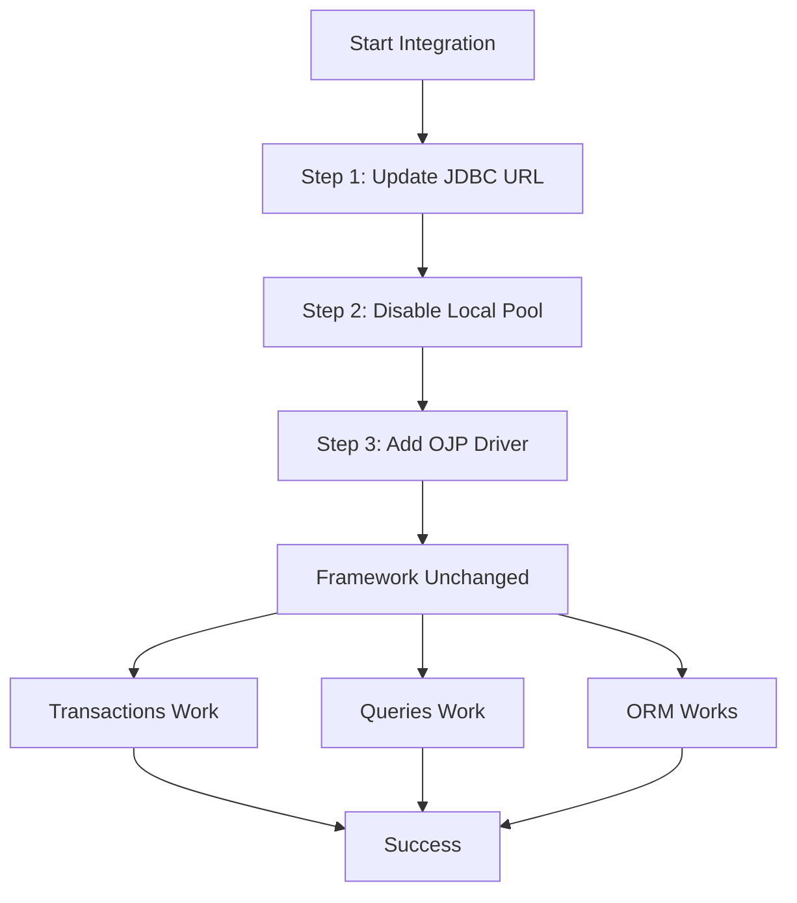
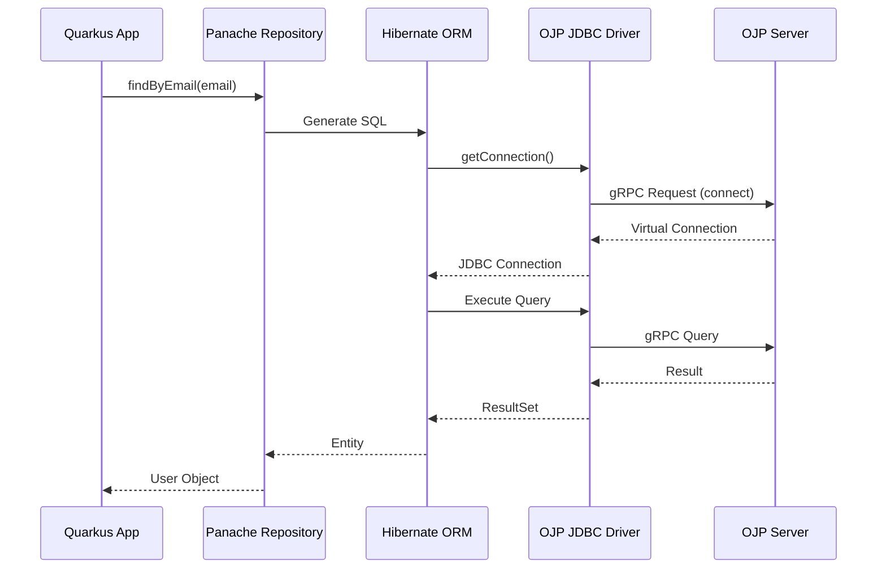
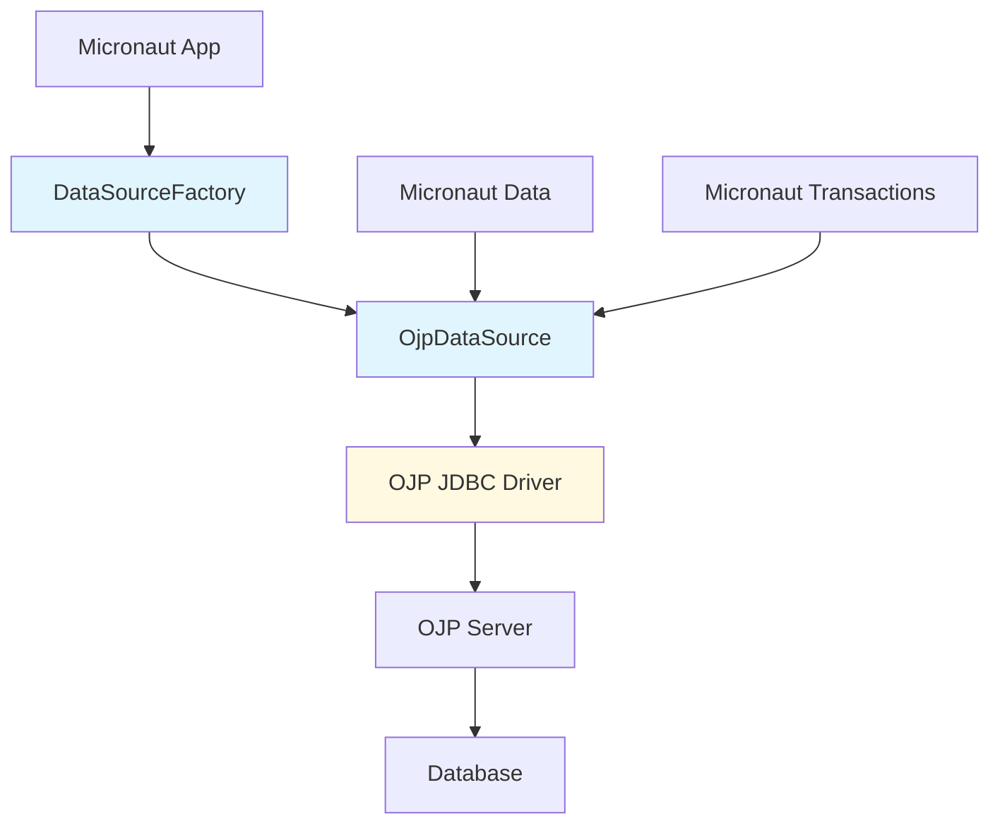
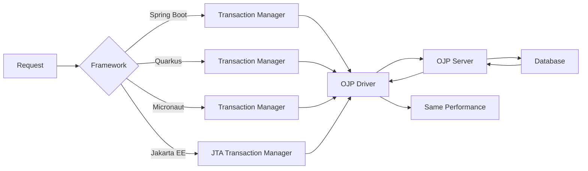
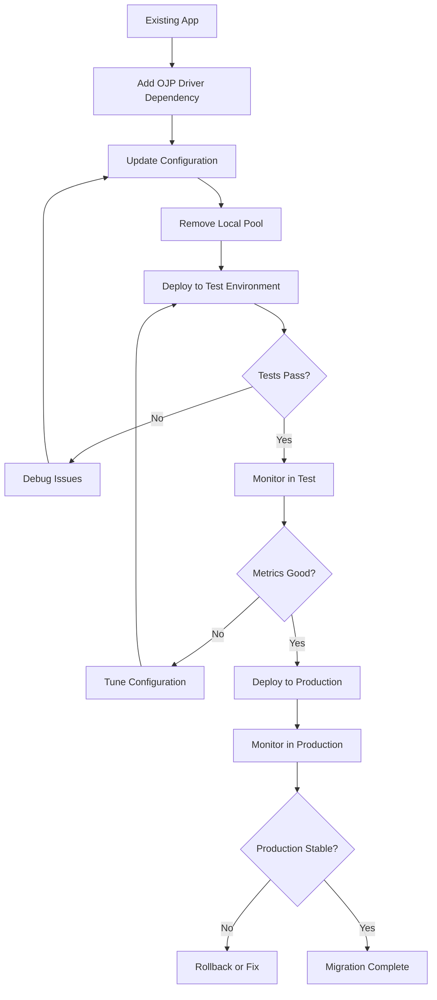

# Chapter 7: Framework Integration

Modern Java applications rarely use raw JDBC. Instead, they leverage frameworks like Spring Boot, Quarkus, Micronaut, and Jakarta EE that provide database integration, dependency injection, and transaction management. Integrating OJP with these frameworks is straightforward, but it requires understanding how each framework handles connection pooling and datasource configuration. The key insight is simple: OJP replaces your application's connection pool, so you must disable the framework's built-in pooling to avoid double-pooling anti-patterns.

In this chapter, we'll explore how to integrate OJP with four major Java application frameworks. While the specific mechanics differ, the underlying principle remains consistent: modify your connection URL, remove local pooling, and add the OJP JDBC driver dependency. Once configured, your framework's database features work exactly as before—queries, transactions, and ORM integration all function normally. The difference happens behind the scenes, where OJP manages connections centrally instead of creating isolated pools in each application instance.

## 7.1 Understanding Framework Integration Patterns

Before diving into framework-specific details, let's understand why OJP integration follows a consistent pattern. Traditional frameworks bundle connection pooling libraries like HikariCP directly into your application. When your application starts, the framework creates a local connection pool with connections to your database. This works fine for monolithic applications, but creates problems in distributed architectures where hundreds of microservices each maintain their own isolated pools.

OJP changes this model by moving pooling to a central server. Your application still uses familiar datasource APIs and transaction management, but instead of pooling real database connections, it creates lightweight virtual connections to the OJP server. The server maintains the actual database connection pool and coordinates access across all your application instances.

**[IMAGE PROMPT: Create a before/after architecture diagram comparing traditional vs OJP connection management. Top half "Before OJP": Show 3 application instances, each with its own HikariCP pool (mini pool icons) connecting to database, resulting in 3 separate connection pools. Label: "Each app maintains separate pool, difficult to coordinate". Bottom half "With OJP": Show 3 application instances with thin dotted lines to central OJP Server (large pool icon), which connects to database with single consolidated pool. Label: "Centralized pooling, coordinated management". Style: Clear before/after comparison with color coding—red for problematic pattern, green for improved pattern.]**

This architectural shift requires you to disable the framework's local connection pooling. If you leave it enabled, the local pool will never close connections, which is the signal OJP JDBC uses to return connections to the OJP server pool. Without this signal, connections in the OJP server become locked to specific local pool instances and eventually cause allocation failures. The issue isn't connection multiplication—it's that the local pool breaks OJP's connection lifecycle management.

The integration pattern always follows three steps, regardless of framework. First, update your JDBC URL to use the OJP format that specifies the OJP server location and target database. Second, remove or disable the framework's bundled connection pool implementation. Third, add the OJP JDBC driver as a dependency so your application can communicate with the OJP server.



Let's see how this pattern applies to each framework.

## 7.2 Spring Boot Integration

Spring Boot is the most widely used Java framework, and integrating OJP with it showcases the typical challenges and solutions. Spring Boot applications by default include HikariCP as their connection pool implementation. This tight integration makes Spring Boot applications fast and efficient out of the box, but it also means you need to prevent the local pool from interfering with OJP's server-side connection management.

OJP ships a dedicated Spring Boot Starter—`spring-boot-starter-ojp`—that removes all of this friction. Add a single dependency, set your OJP JDBC URL, and the starter handles everything else automatically.

### Using the Spring Boot Starter (Recommended)

The `spring-boot-starter-ojp` artifact provides zero-configuration Spring Boot integration for both Spring Boot 4.x (Java 17+) and Spring Boot 3.x. Replace `spring-boot-starter-jdbc` with the OJP starter:

```xml
<!-- Replace spring-boot-starter-jdbc with the OJP starter -->
<dependency>
    <groupId>org.openjproxy</groupId>
    <artifactId>spring-boot-starter-ojp</artifactId>
    <version>0.4.11-beta</version>
</dependency>
```

With the starter on the classpath, a minimal `application.properties` is all you need:

```properties
# OJP connection URL — the only required setting
spring.datasource.url=jdbc:ojp[localhost:1059]_postgresql://user@localhost/mydb
spring.datasource.username=myuser
spring.datasource.password=mypassword
```

The starter automatically detects the OJP URL and sets:
- `spring.datasource.driver-class-name=org.openjproxy.jdbc.Driver`
- `spring.datasource.type=org.springframework.jdbc.datasource.SimpleDriverDataSource`

Setting the datasource type to `SimpleDriverDataSource` is crucial. This tells Spring Boot to obtain single connections directly rather than attempting to pool them. Since OJP already provides pooling centrally on the proxy server, this configuration avoids double-pooling while maintaining Spring's transaction management and other datasource features.

**[IMAGE PROMPT: Create a side-by-side code comparison showing application.properties transformation. Left side labeled "Before OJP (manual)": Shows three explicit settings for url, driver-class-name, and type. Right side labeled "With OJP Starter": Shows only the url property, with annotations showing the two settings automatically injected by the starter. Style: Clean code comparison with syntax highlighting and arrows pointing to the automatic values.]**

You can also tune the OJP server-side connection pool directly from `application.yml`:

```yaml
ojp:
  connection:
    pool:
      maximum-pool-size: 20
      minimum-idle: 5
      connection-timeout: 10000
      idle-timeout: 600000
      max-lifetime: 1800000
  grpc:
    max-inbound-message-size: 16777216   # bytes; increase for large LOB columns
```

Or in `application.properties`:

```properties
# OJP server-side connection pool settings (forwarded to the OJP server via gRPC)
ojp.connection.pool.maximum-pool-size=20
ojp.connection.pool.minimum-idle=5
ojp.connection.pool.connection-timeout=10000
ojp.connection.pool.idle-timeout=600000
ojp.connection.pool.max-lifetime=1800000

# gRPC transport settings (increase for large LOB data)
ojp.grpc.max-inbound-message-size=16777216
```

### Per-Datasource vs. Global Settings

Not all OJP settings accept a datasource name prefix. Pool settings are scoped per datasource; operational settings (health checks, redistribution, load-aware routing, retry) are cluster-wide.

| Setting group | Supports `dsName.` prefix? |
|---|---|
| `ojp.connection.pool.*` | ✅ Yes |
| `ojp.xa.connection.pool.*` | ✅ Yes |
| `ojp.grpc.*` | ✅ Yes |
| `ojp.health.check.*` | ❌ Global only |
| `ojp.redistribution.*` | ❌ Global only |
| `ojp.loadaware.selection.enabled` | ❌ Global only |
| `ojp.multinode.*` | ❌ Global only |

The datasource name is always specified inside the JDBC URL using parentheses. The matching pool settings are then prefixed with that name in `application.yml`:

```yaml
spring:
  datasource:
    # ── Named datasource "webapp" ──────────────────────────────────────────
    url: jdbc:ojp[localhost:1059(webapp)]_postgresql://localhost:5432/mydb
    username: myuser
    password: mypassword

# ✅ Per-datasource pool settings — prefixed with the datasource name
webapp:
  ojp:
    connection:
      pool:
        maximum-pool-size: 60
        minimum-idle: 15
        connection-timeout: 5000
    xa:
      connection:
        pool:
          max-total: 50
          min-idle: 10

# ❌ Global settings — no prefix; apply to the entire cluster
ojp:
  multinode:
    retry-attempts: -1
    retry-delay-ms: 5000
  health:
    check:
      interval: 5s
      threshold: 5s
      timeout: 5s
  redistribution:
    enabled: true
    idle-rebalance-fraction: 1.0
    max-close-per-recovery: 100
  loadaware:
    selection:
      enabled: true
```

> **Tip — Named datasource:** To target a named pool configuration on the OJP server, embed the
> datasource name in the JDBC URL:
> `spring.datasource.url=jdbc:ojp[localhost:1059(myApp)]_postgresql://...`

### Manual Configuration (Spring Boot 3.x / Java 11)

If you cannot use the starter (for example, in Java 11 projects where the starter's Java 17 requirement cannot be met), the manual three-step approach still works. Add the JDBC driver dependency and exclude HikariCP explicitly:

```xml
<!-- Add OJP JDBC Driver -->
<dependency>
    <groupId>org.openjproxy</groupId>
    <artifactId>ojp-jdbc-driver</artifactId>
    <version>0.4.11-beta</version>
</dependency>

<!-- Spring JDBC Starter WITHOUT HikariCP -->
<dependency>
    <groupId>org.springframework.boot</groupId>
    <artifactId>spring-boot-starter-jdbc</artifactId>
    <exclusions>
        <exclusion>
            <groupId>com.zaxxer</groupId>
            <artifactId>HikariCP</artifactId>
        </exclusion>
    </exclusions>
</dependency>
```

Then set all three datasource properties explicitly:

```properties
# application.properties — manual OJP configuration
spring.datasource.url=jdbc:ojp[localhost:1059]_postgresql://localhost:5432/mydb
spring.datasource.driver-class-name=org.openjproxy.jdbc.Driver
spring.datasource.type=org.springframework.jdbc.datasource.SimpleDriverDataSource
spring.datasource.username=myuser
spring.datasource.password=mypassword
```

The URL format inserts `ojp[hostname:port]_` immediately after `jdbc:`, where hostname and port identify your OJP server. The remainder of the URL is your standard database-specific JDBC URL.

### Spring Boot with JPA and Hibernate

Spring Boot applications often use Spring Data JPA with Hibernate for object-relational mapping. The good news is that OJP integrates seamlessly with this stack regardless of whether you use the starter or manual configuration. Your JPA repositories, entity mappings, and `@Transactional` annotations all work exactly as before. Hibernate doesn't know or care that connections come from OJP—it just sees standard JDBC connections.

```properties
# Full configuration with JPA/Hibernate (using the starter)
spring.datasource.url=jdbc:ojp[localhost:1059]_postgresql://localhost:5432/mydb
spring.datasource.username=myuser
spring.datasource.password=mypassword

spring.jpa.database-platform=org.hibernate.dialect.PostgreSQLDialect
spring.jpa.hibernate.ddl-auto=validate
spring.jpa.show-sql=false
spring.jpa.properties.hibernate.format_sql=true
```

#### Surfacing DDL errors eagerly

When Hibernate is configured to create or update the schema (`ddl-auto=create`, `create-drop`, or
`update`), any DDL failure—for example a table that could not be created—is **silently swallowed by
default**. The error only surfaces later at runtime, when the affected table is first accessed, which
makes debugging significantly harder.

Add the following property to make Hibernate halt immediately and report the error as soon as a DDL
operation fails:

```properties
spring.jpa.properties.hibernate.hbm2ddl.halt_on_error=true
```

> **Note:** This is standard **Hibernate behaviour**, not something specific to OJP. The flag works
> regardless of which JDBC driver or connection proxy you are using. Enabling it during development
> and in CI pipelines is strongly recommended: it turns a mysterious runtime `TableNotFoundException`
> into an immediate, actionable error at startup.

Your entity classes, repositories, and service layer remain unchanged. The only difference is in how connections are acquired behind the scenes:

```java
@Service
@Transactional
public class UserService {
    @Autowired
    private UserRepository userRepository;
    
    public User createUser(String name, String email) {
        User user = new User();
        user.setName(name);
        user.setEmail(email);
        return userRepository.save(user);  // OJP manages the connection
    }
}
```


## 7.3 Quarkus Integration

Quarkus, the Kubernetes-native Java framework, emphasizes fast startup times and low memory footprint. Its integration with OJP follows the same three-step pattern but with Quarkus-specific configuration syntax. Quarkus applications use Agroal as their default connection pool, which you'll disable in favor of OJP.

Start with the Maven dependency for OJP's JDBC driver:

```xml
<dependency>
    <groupId>org.openjproxy</groupId>
    <artifactId>ojp-jdbc-driver</artifactId>
    <version>0.4.11-beta</version>
</dependency>
```

Quarkus configuration lives in `application.properties`, where you'll specify datasource settings. The key is enabling JDBC but marking it as unpooled. Quarkus respects this configuration and creates simple non-pooled connections instead of using Agroal:

```properties
# application.properties for Quarkus with OJP
quarkus.datasource.jdbc=true
quarkus.datasource.jdbc.unpooled=true
quarkus.datasource.jdbc.url=jdbc:ojp[localhost:1059]_postgresql://localhost:5432/mydb
quarkus.datasource.jdbc.driver=org.openjproxy.jdbc.Driver
quarkus.datasource.username=myuser
quarkus.datasource.password=mypassword
```

The `unpooled=true` setting is Quarkus's explicit way of indicating you don't want connection pooling at the application layer. This maps directly to our requirement of avoiding double-pooling with OJP.

**[IMAGE PROMPT: Create a Quarkus-specific configuration diagram showing the application.properties file with key settings highlighted. Show three configuration layers: top layer "JDBC Enabled" (checkmark icon), middle layer "Unpooled Mode" (crossed-out pool icon), bottom layer "OJP URL & Driver" (connection icon). Use arrows to show how these settings work together to disable local pooling while enabling OJP connectivity. Style: Layered technical diagram with clear annotations.]**

### Quarkus Native Mode Considerations

Quarkus's killer feature is native compilation with GraalVM, producing executables that start in milliseconds with minimal memory. OJP works with Quarkus native mode, but you must ensure the OJP JDBC driver and its dependencies are properly configured for native compilation.

The OJP driver is designed to be GraalVM-compatible, but you should test your native build thoroughly. Include database operations in your native tests to verify the complete integration path. If you encounter issues, check that reflection configuration includes the OJP driver class and any database-specific driver classes it loads.

```properties
# Native build configuration
quarkus.native.additional-build-args=--initialize-at-run-time=org.openjproxy.jdbc.Driver
```

### Quarkus with Hibernate ORM and Panache

Quarkus applications often use Hibernate ORM with Panache for elegant data access patterns. OJP integrates seamlessly here too. Your Panache entities and repositories work without modification:

```java
@Entity
public class User extends PanacheEntity {
    public String name;
    public String email;
    
    public static User findByEmail(String email) {
        return find("email", email).firstResult();
    }
}

@ApplicationScoped
public class UserService {
    @Transactional
    public User createUser(String name, String email) {
        User user = new User();
        user.name = name;
        user.email = email;
        user.persist();  // OJP manages the connection
        return user;
    }
}
```

The key is that Hibernate never knows it's using OJP. From Hibernate's perspective, it's just getting JDBC connections from a datasource. The fact that those connections are virtual connections to an OJP server is transparent to the ORM layer.



## 7.4 Micronaut Integration

Micronaut, designed for microservices and cloud-native applications, takes a slightly different approach to datasource configuration. While Spring Boot and Quarkus let you simply disable pooling, Micronaut requires you to provide a custom DataSource bean that creates unpooled connections.

The first step remains familiar—add the OJP JDBC driver dependency:

```xml
<dependency>
    <groupId>org.openjproxy</groupId>
    <artifactId>ojp-jdbc-driver</artifactId>
    <version>0.4.11-beta</version>
</dependency>
```

Next, remove Micronaut's default HikariCP dependency from your project:

```xml
<!-- Remove this dependency -->
<dependency>
    <groupId>io.micronaut.sql</groupId>
    <artifactId>micronaut-jdbc-hikari</artifactId>
</dependency>
```

Now comes the Micronaut-specific part: creating a DataSource factory. Micronaut's dependency injection system expects to find a DataSource bean, so you'll create one using `OjpDataSource`—OJP's built-in `DataSource` implementation:

```java
import io.micronaut.context.annotation.Factory;
import io.micronaut.context.annotation.Value;
import jakarta.inject.Named;
import jakarta.inject.Singleton;
import org.openjproxy.jdbc.OjpDataSource;

import javax.sql.DataSource;

@Factory
public class DataSourceFactory {

    @Singleton
    @Named("default")
    public DataSource dataSource(
        @Value("${datasources.default.url}") String url,
        @Value("${datasources.default.username}") String user,
        @Value("${datasources.default.password}") String password
    ) {
        return new OjpDataSource(url, user, password);
    }
}
```

**[IMAGE PROMPT: Create a code visualization showing the Micronaut DataSource factory pattern. Show a class diagram-style representation with DataSourceFactory at the top, connecting to OjpDataSource below. Highlight that this pattern bypasses HikariCP pooling. Use arrows labeled "Creates" and "Returns" to show relationships. Include a code snippet for the factory method. Style: Clean UML-style class diagram with code integration.]**

`OjpDataSource` is a fully compliant `javax.sql.DataSource` implementation that manages virtual connections through the OJP server. You no longer need to implement the `DataSource` interface manually or register the driver with `DriverManager`—`OjpDataSource` handles all of that automatically.

Your `application.properties` file provides the configuration values:

```properties
datasources.default.url=jdbc:ojp[localhost:1059]_postgresql://localhost:5432/mydb
datasources.default.username=myuser
datasources.default.password=mypassword

# If using Hibernate with Micronaut
jpa.default.properties.hibernate.dialect=org.hibernate.dialect.PostgreSQLDialect
```

### Micronaut Data Integration

Micronaut Data provides compile-time generated repositories similar to Spring Data. These work seamlessly with OJP once you've configured the datasource:

```java
@Repository
public interface UserRepository extends CrudRepository<User, Long> {
    Optional<User> findByEmail(String email);
}

@Singleton
public class UserService {
    @Inject
    private UserRepository userRepository;
    
    @Transactional
    public User createUser(String name, String email) {
        User user = new User();
        user.setName(name);
        user.setEmail(email);
        return userRepository.save(user);  // OJP manages the connection
    }
}
```

The key insight is that your data access code doesn't change. Whether you're using Spring Boot, Quarkus, or Micronaut, your repositories, services, and transactions work exactly the same way. OJP integration happens at the configuration layer, not in your business logic.



## 7.5 Jakarta EE Integration

Jakarta EE applications can integrate with OJP using only the standard `ojp-jdbc-driver` artifact—no framework-specific adapter is needed. The overall pattern is the same as other frameworks: disable client-side connection pooling so that OJP can manage connections centrally.

Jakarta EE applications typically run inside an **application server** (such as GlassFish, WildFly, Payara, Open Liberty, or TomEE). Unlike embedded-server frameworks, the datasource is usually declared at the server level and accessed by applications through **JNDI**. Jakarta EE uses **CDI + JTA** for dependency injection and transaction management, and the default JPA provider varies by server (GlassFish and Payara bundle EclipseLink; WildFly and Open Liberty use Hibernate). The examples below use GlassFish 7 as the reference implementation of Jakarta EE 10, but the same principle applies to any compliant application server—only the server-specific datasource configuration file (e.g., `glassfish-resources.xml`, `wildfly-ds.xml`, `server.xml`) differs.

> A complete working example—including JAX-RS resources, CDI repositories, JPA entities, and Arquillian integration tests—is available at [ojp-framework-integration / glassfish/shopservice](https://github.com/Open-J-Proxy/ojp-framework-integration/tree/main/glassfish/shopservice).

### Step 1 — Add the OJP JDBC driver dependency

```xml
<dependency>
    <groupId>org.openjproxy</groupId>
    <artifactId>ojp-jdbc-driver</artifactId>
    <version>0.4.11-beta</version>
</dependency>
```

For production, you must also copy the driver JAR to GlassFish's domain library directory so that the server-level connection pool manager can load it:

```bash
cp ojp-jdbc-driver-*.jar $GLASSFISH_HOME/domains/domain1/lib/
```

### Step 2 — Configure the datasource (GlassFish example: `WEB-INF/glassfish-resources.xml`)

The datasource is configured at the server level. On GlassFish this is done via `WEB-INF/glassfish-resources.xml`; other servers use equivalent deployment descriptors (e.g., `wildfly-ds.xml` for WildFly, `server.xml` for TomEE). The key requirement on any server is to **disable client-side connection pooling** so that OJP can manage connections centrally—equivalent to `SimpleDriverDataSource` in Spring Boot or `unpooled=true` in Quarkus. On GlassFish, set `steady-pool-size="0"` and `max-connection-usage-count="1"`:

```xml
<?xml version="1.0" encoding="UTF-8"?>
<!DOCTYPE resources PUBLIC
    "-//GlassFish.org//DTD GlassFish Application Server 3.1 Resource Definitions//EN"
    "http://glassfish.org/dtds/glassfish-resources_1_5.dtd">

<resources>

    <jdbc-connection-pool
        name="MyAppPool"
        res-type="java.sql.Driver"
        driver-classname="org.openjproxy.jdbc.Driver"
        steady-pool-size="0"
        idle-timeout-in-seconds="0"
        max-connection-usage-count="1">
        <property name="url"
                  value="jdbc:ojp[localhost:1059]_postgresql://localhost/mydb"/>
        <property name="user" value="dbuser"/>
        <property name="password" value="dbpass"/>
    </jdbc-connection-pool>

    <jdbc-resource
        jndi-name="jdbc/myapp"
        pool-name="MyAppPool"/>

</resources>
```

`res-type="java.sql.Driver"` tells GlassFish to use the `Driver` interface for connection creation. `steady-pool-size="0"` and `max-connection-usage-count="1"` ensure no connections are held idle and each connection is discarded after a single use, preventing GlassFish from pooling OJP virtual connections and interfering with OJP's server-side lifecycle management.

#### Multinode URL in `glassfish-resources.xml`

When using OJP in **multinode mode**, GlassFish's XML parser treats unescaped commas inside a
`<property value="..."/>` attribute as property-value list separators, silently truncating the
URL. XML-escape each comma with `&#44;`. See
[Multinode URL in `glassfish-resources.xml`](../java-frameworks/jakarta-ee/README.md#multinode-url-in-glassfish-resourcesxml)
in the Jakarta EE guide for the full explanation and example.

### Step 3 — Reference the JNDI datasource in `META-INF/persistence.xml`

```xml
<persistence-unit name="myapp" transaction-type="JTA">
    <jta-data-source>jdbc/myapp</jta-data-source>
    <properties>
        <property name="jakarta.persistence.schema-generation.database.action" value="create"/>
    </properties>
</persistence-unit>
```

The JNDI name (`jdbc/myapp`) must match the `jndi-name` attribute in `glassfish-resources.xml`. No OJP-specific configuration goes into `persistence.xml`—it is pure standard Jakarta EE.

### Step 4 — Use CDI, JAX-RS, and JPA as usual

Your application code uses only standard Jakarta EE APIs. OJP is completely transparent at the business logic layer:

```java
@ApplicationScoped
public class UserRepository {

    @PersistenceContext(unitName = "myapp")
    private EntityManager em;

    @Transactional
    public User create(User user) {
        em.persist(user);
        return user;
    }
}

@Path("/users")
@RequestScoped
public class UserResource {

    @Inject
    private UserRepository repository;

    @POST
    @Consumes(MediaType.APPLICATION_JSON)
    @Produces(MediaType.APPLICATION_JSON)
    public Response createUser(User user) {
        return Response.status(Response.Status.CREATED)
                       .entity(repository.create(user)).build();
    }
}
```

**[IMAGE PROMPT: Create an architecture diagram for the GlassFish / Jakarta EE integration. Show a GlassFish 7 application server box containing: WAR file (with JAX-RS resources, CDI repositories, JPA entities), a JNDI registry labeled "jdbc/myapp", and GlassFish JDBC pool (with steady-pool-size=0 label). Draw an arrow from the JDBC pool through the OJP JDBC Driver (outside the server box) to the OJP Server (separate box), which connects to the Database. Label the GlassFish pool arrow "max-connection-usage-count=1 (no local pooling)". Style: Technical architecture diagram with distinct boxes for server, driver, proxy, and database.]**

### Integration testing

For integration testing with Arquillian and GlassFish Embedded, see the reference demo at
[ojp-framework-integration / glassfish/shopservice](https://github.com/Open-J-Proxy/ojp-framework-integration/tree/main/glassfish/shopservice),
which demonstrates `@DataSourceDefinition`-based datasource registration, ShrinkWrap archive setup,
test persistence units, and required JVM flags.

## 7.6 Framework Comparison and Trade-offs

Each framework brings its own philosophy and trade-offs to OJP integration. Spring Boot offers the smoothest integration path because it has mature support for customizing datasource configuration. The exclusion mechanism for removing HikariCP is well-documented and widely used. Spring Boot's configuration hierarchy also makes it easy to have different settings for different environments.

Quarkus provides the most explicit configuration through its `unpooled=true` setting. There's no ambiguity about whether pooling is enabled—the configuration clearly states the intent. Quarkus's focus on native compilation means you get excellent startup times and memory efficiency, though you must verify GraalVM compatibility for your specific deployment.

Micronaut uses a DataSource factory bean backed by `OjpDataSource`, OJP's built-in `DataSource` implementation. This approach is concise—just three lines in the factory method—and gives you a fully compliant `DataSource` without implementing any interfaces manually. If you need custom logic around connection creation—perhaps for multi-tenancy or dynamic datasource routing—Micronaut's factory pattern still provides natural extension points.

**[IMAGE PROMPT: Create a comparison matrix showing the four frameworks. Four columns (Spring Boot, Quarkus, Micronaut, GlassFish/Jakarta EE), rows for: "Configuration Complexity" (Low/Low/Medium/Medium), "Custom Code Required" (None/None/Factory Class/None), "Native Compilation" (Limited/Excellent/Good/No), "Ecosystem Maturity" (Highest/Growing/Moderate/Mature/Standard), "Integration Smoothness" (Smoothest/Smooth/Moderate/Standard). Use color coding: green for best, yellow for good, orange for moderate. Style: Professional comparison matrix with visual indicators.]**

All four frameworks support the full feature set of JDBC and JPA. Transactions, connection pooling (via OJP), batch operations, and stored procedures all work correctly regardless of framework choice. The differences lie in configuration style rather than capabilities.

### Performance Considerations

From a performance perspective, the framework choice has minimal impact on OJP integration. Once connections are acquired, all frameworks use the same underlying JDBC APIs. The OJP driver handles communication with the OJP server identically regardless of which framework initiated the request.

The main performance difference comes from how frameworks handle transaction boundaries and connection lifecycle. Spring's transaction management is mature and optimizes connection holding time well. Quarkus's reactive extensions can provide better throughput for high-concurrency scenarios, though this applies to the entire application stack, not just OJP integration.

What matters most is ensuring you've disabled local connection pooling correctly. A misconfigured application that maintains both local pooling and OJP connections will show degraded performance due to the double-pooling overhead. Monitor your application's connection behavior to verify that only OJP connections are being created.



## 7.7 Integration Best Practices

Successful OJP integration across frameworks follows common patterns. First, always verify that local connection pooling is completely disabled. Check your dependency tree to ensure no pooling libraries are included. Run your application with debug logging and observe connection acquisition—you should see OJP driver activity, not local pool creation.

Second, use framework-specific health checks to monitor database connectivity. Spring Boot Actuator, Quarkus health endpoints, and Micronaut health indicators all support datasource health checks. These help you quickly identify connectivity issues between your application and the OJP server.

```properties
# Spring Boot health check
management.endpoint.health.show-details=always
management.health.db.enabled=true

# Quarkus health check
quarkus.datasource.health.enabled=true

# Micronaut health check
endpoints.health.jdbc.enabled=true
```

Third, configure appropriate timeouts at both the framework level and in your OJP properties file. The framework's datasource timeout should be slightly longer than OJP's connection acquisition timeout to avoid racing error conditions. This ensures OJP's circuit breaker can trip before your framework timeout fires, giving you clearer error messages.

**[IMAGE PROMPT: Create a timing diagram showing timeout coordination. Show three horizontal bars representing different timeout layers from top to bottom: "Framework Datasource Timeout" (90s), "OJP Connection Acquisition" (60s), and "Database Query Timeout" (30s). Use arrows and labels to show cascading timeout behavior: if database times out, OJP catches it; if OJP times out, framework catches it. Style: Technical timing diagram with color-coded layers and clear duration labels.]**

Fourth, leverage your framework's transaction management properly. Use `@Transactional` annotations (or equivalent) to define clear transaction boundaries. OJP tracks transaction state across the virtual connection, ensuring that real database connections are held only for the duration of your transactions, not the entire HTTP request.

Finally, test your integration thoroughly. Write integration tests that exercise database operations through your framework's repository layer. Verify that transactions commit and rollback correctly, that connection leaks don't occur, and that concurrent requests don't interfere with each other. These tests give you confidence that OJP integration works correctly in your specific application context.

## 7.8 Migration from Existing Applications

If you're adding OJP to an existing application, the migration process is straightforward but requires careful testing. Start with a non-production environment where you can experiment safely. Make a checklist of the configuration changes needed for your specific framework.

The migration typically proceeds in phases. First, deploy the OJP server and verify it can connect to your database. Configure a small test application to use OJP and validate that basic operations work. Then migrate one application at a time, monitoring each for connection behavior and performance.

During migration, watch for common pitfalls. Applications that manually create datasources in code rather than using framework configuration might bypass your OJP setup. Custom connection management code that assumes local database access may need adjustment. Connection string builders that construct URLs programmatically need updates to include the OJP server specification.

**[IMAGE PROMPT: Create a migration roadmap showing five phases as connected blocks: "1. Deploy OJP Server" → "2. Test Connection" → "3. Update Config" → "4. Test Application" → "5. Monitor Production". Each block contains 2-3 checkpoints. Use a timeline-style layout with checkmarks for completed steps and circles for pending steps. Include risk indicators (red/yellow/green) for each phase. Style: Project management roadmap with clear progression.]**

Monitor your applications closely after migration. Look at connection metrics, query performance, transaction success rates, and error logs. Compare these metrics to pre-migration baselines to ensure OJP integration hasn't introduced regressions. Most issues surface quickly if they exist—within the first day or two of running with real traffic.



## Summary

Integrating OJP with modern Java frameworks is straightforward once you understand the core principle: disable local connection pooling and configure the OJP JDBC driver. Spring Boot, Quarkus, Micronaut, and Jakarta EE application servers all support this integration, though each uses different configuration mechanisms.

Spring Boot users have the easiest path: add the `spring-boot-starter-ojp` dependency and set a single connection URL. The starter's auto-configuration automatically selects the correct driver and datasource type, and its `OjpSystemPropertiesBridge` forwards any `ojp.*` properties from `application.properties` to the driver without a separate `ojp.properties` file. For Java 11 projects that cannot use the starter, the manual path—exclude HikariCP, add the driver, set `SimpleDriverDataSource`—achieves the same result. Quarkus users enable unpooled JDBC mode. Micronaut users create a `DataSourceFactory` that returns an `OjpDataSource`—OJP's built-in `DataSource` implementation—making the factory trivially small. Jakarta EE users configure the application server datasource with client-side pooling disabled, which achieves the same unpooled effect using the server's own connection pool tuning knobs. All approaches achieve the same goal: creating single connections that connect to OJP rather than maintaining local connection pools.

The beauty of this integration is that your application code doesn't change. Repositories, services, transactions, and ORM mappings all work exactly as before. OJP integration happens entirely at the configuration layer, making it low-risk and reversible if needed.

Choose your framework based on your application requirements, not OJP compatibility—all four work excellently with OJP. Focus on properly disabling local pooling, configuring appropriate timeouts, and monitoring connection behavior to ensure your integration works correctly.

**[IMAGE PROMPT: Create a summary diagram showing the four frameworks (Spring Boot, Quarkus, Micronaut, Jakarta EE logos) all connecting to a central OJP Server icon, which then connects to a database. Above Spring Boot show "spring-boot-starter-ojp (zero config)" with a green star. Above Quarkus show "Unpooled=true". Above Micronaut show "OjpDataSource". Above Jakarta EE show "Server datasource (JNDI)". Below the database, show benefits: "Centralized Pooling", "Coordinated Management", "Transparent to App Code". Style: Clean architectural summary with icons and clear relationships.]**
