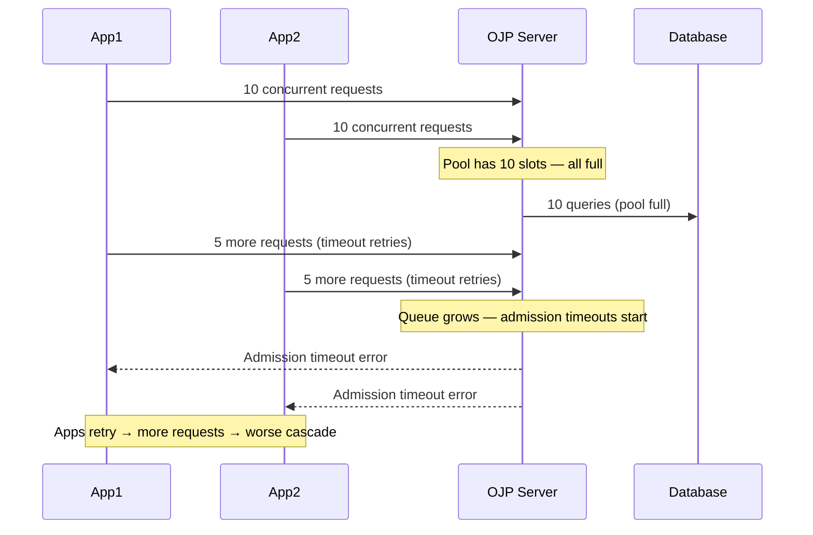
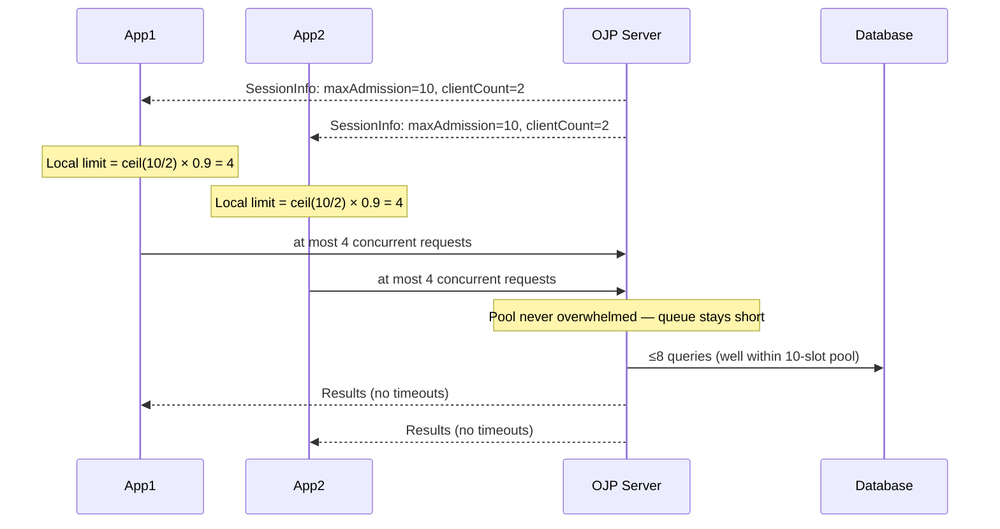
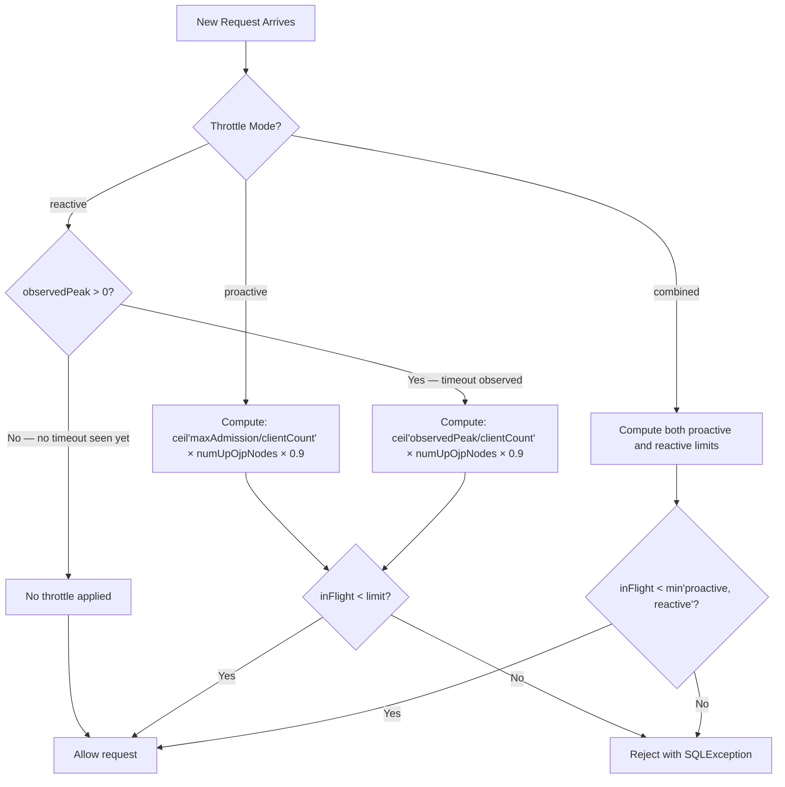
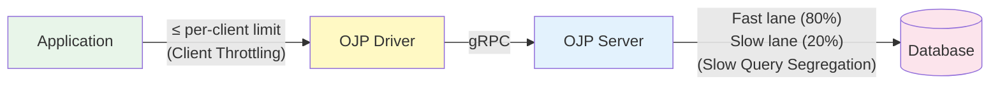

# Chapter 8a: Client-Side Throttling

## Introduction

Imagine a busy highway that feeds into a tunnel. The tunnel can only handle 10 lanes of traffic
at a time. Without any control at the on-ramps, hundreds of cars pile up trying to enter
simultaneously, causing gridlock inside and outside the tunnel. Now imagine that the on-ramps
have smart meters that limit the flow based on how many cars are already inside. Traffic keeps
moving because no more cars enter than the tunnel can handle.

OJP's Client-Side Throttling works exactly like those smart on-ramp meters — but for database
requests. When the OJP server's connection pool is under pressure, it signals back to every
connected application how many concurrent requests it can safely absorb. Each application
then limits itself to its fair share, preventing gridlock at the database level.

> **Use this feature when** you have multiple application instances connecting to the same
> database through OJP and want to prevent overload cascades. It is enabled by default — no
> configuration change is required to benefit from it.

---

## The Problem: Overload Cascades

Without client-side throttling, here is what happens when the database slows down:

1. The OJP server's connection pool fills up — all slots are busy.
2. New requests from applications must wait (queue up) for a free slot.
3. As the queue grows, waiting threads hold resources on the application side.
4. Applications start throwing timeout errors or retry, sending **even more requests**.
5. The queue grows faster, timeouts cascade, and the system becomes unresponsive.

This is an **overload cascade** — the system gets worse the harder it is pushed, because
clients don't know they should slow down.



**With client-side throttling**, each application caps itself before sending requests. The
server never gets more concurrent requests than it can handle, the queue stays short, and
admission timeouts stop happening:



---

## How It Works

### Step 1 — Server signals its capacity

Every time a JDBC connection is established, the OJP server includes three numbers in its
response (inside the `SessionInfo` message that the driver receives):

| Field | Meaning | Example |
|---|---|---|
| `maxAdmission` | The server's connection pool size on this node | `10` |
| `clientCount` | How many distinct application instances (JVMs) are currently connected for this database/credential pair | `2` |
| `observedPeak` | The highest in-flight count just before the last admission timeout (0 = no timeout has occurred yet) | `8` |

These numbers tell each client exactly how busy the server is and how many peers are sharing it.

### Step 2 — Driver computes its fair share

The driver uses a simple formula to compute its per-client limit:

```
effectiveCapacity = observedPeak  (if a timeout has occurred)
                  = maxAdmission  (if no timeout has occurred yet)

rawLimit = ceil(effectiveCapacity / clientCount) × numUpOjpNodes
limit    = floor(rawLimit × 0.9)   ← 10% safety headroom
limit    = max(1, limit)            ← always allow at least 1
```

**Example**: 5 application instances, OJP pool size 20, single-node cluster.

```
effectiveCapacity = 20 (no timeouts yet)
rawLimit = ceil(20 / 5) × 1 = 4
limit    = floor(4 × 0.9) = 3
```

Each of the 5 apps allows at most 3 concurrent requests. Combined: up to 15 in-flight
against a 20-slot pool — a comfortable 75% utilisation with headroom to spare.

**Why ceiling division, not floor?**
Floor division (`20/7 = 2`) leaves 6 slots permanently idle even at full load. Ceiling
(`ceil(20/7) = 3`) makes full use of capacity. The 10% deduction then absorbs one stale
`clientCount` reading without affecting steady-state throughput.

**Why 10% headroom?**
When `clientCount` is slightly stale (a client just connected or disconnected), the limit
could be off by one client's worth of slots. 10% is usually enough to absorb that error
without meaningfully reducing throughput.

### Step 3 — Driver enforces the limit (fail-fast, non-blocking)

The driver uses an `AtomicInteger` counter instead of a blocking `Semaphore`. This is
important for performance:

```java
// Before sending request to OJP server:
if (inFlight.incrementAndGet() > limit) {
    inFlight.decrementAndGet();
    throw new SQLException("Client throttle limit reached; request rejected to avoid overloading the database");
}

// After request completes (always in finally block):
inFlight.decrementAndGet();
```

- On the **happy path** (under limit): one atomic increment + one comparison. Near-zero overhead.
- When the **limit is exceeded**: the request is rejected immediately with a `SQLException`, no blocking.

**In-transaction bypass**: if a connection is already inside a transaction (`autoCommit = false`),
subsequent statements on that connection are allowed through without checking the throttle. This
prevents a deadlock where a statement needs to complete in order to free a slot, but cannot get
a slot because the limit is already reached. Transactions typically run to completion quickly anyway.

### Step 4 — Limit adapts over time (AIMD)

The limit is not static — it adjusts as `SessionInfo` arrives with updated numbers. However,
increases are step-limited to prevent sudden spikes:

- **Decrease**: applied immediately. If the server reports fewer available slots, the limit
  drops right away (fast overload response).
- **Increase**: capped at `currentLimit + 1` per update cycle (additive increase).

This is the **AIMD** (Additive Increase, Multiplicative Decrease) algorithm — the same
principle TCP uses to manage congestion on networks.

**Why step-limited increase?**
Without it, when 4 out of 8 clients disconnect simultaneously, every remaining client instantly
recalculates a much higher limit and sends a burst of queued requests. With AIMD, the limit
grows by 1 each time a `SessionInfo` arrives (every few milliseconds under load), so the burst
takes seconds to materialise — too slow to cause a spike.

---

## Three Modes

Client throttling has three modes, configurable per application:

| Mode | How it works | Best for |
|---|---|---|
| `proactive` | Uses `maxAdmission` (static pool size) to compute the limit from day 1. Guarantees fairness between clients. | Stable workloads where the pool size is a reliable capacity signal. |
| `reactive` | Uses `observedPeak` (adaptive real capacity). Limit starts unconstrained; only tightens after the first admission timeout is observed. | Environments where the DB sometimes degrades below its configured pool size. |
| `combined` | `effectiveLimit = min(proactive, reactive)`. Gets fairness from proactive and adaptive protection from reactive. | Recommended for most deployments (this is the **default**). |

### Visual comparison



---

## The Reactive Signal: `observedPeak`

`observedPeak` is the server's way of saying "here is the real capacity I have observed under
load — it may be lower than what I am configured for."

**How the server computes it:**

The server (`SlotManager`) tracks the peak in-flight count. When an admission timeout occurs
(a request waited too long for a pool slot and gave up), it records:

```
observedPeak = max(10% floor, min(current observedPeak, currentActiveCount))
```

This means `observedPeak` snaps **down** immediately on a timeout (fast response). It
recovers slowly: every `totalSlots × 2` successful completions, `observedPeak` increases
by 1. This is the AIMD pattern applied to the server side.

**Example:**

Server has 20 slots. Peak load hit 18 in-flight, then a timeout fired. Client count = 3.

```
observedPeak snaps down to 18
Client limit = ceil(18/3) × 0.9 = floor(6 × 0.9) = 5
```

Previously each client had a limit of `ceil(20/3) × 0.9 = 5` (same in this case).
If the timeout had fired at lower in-flight (say, 12 because the DB was momentarily slow):

```
observedPeak snaps down to 12
Client limit = ceil(12/3) × 0.9 = floor(4 × 0.9) = 3
```

Clients automatically become more conservative, reducing pressure on a struggling DB.

**10% floor:** `observedPeak` never drops below 10% of `totalSlots` (minimum 1). This
prevents a single transient slow query from collapsing all clients to near-zero throughput.

---

## Configuration

### Driver configuration

Set in `ojp.properties`, as an environment variable, or as a JVM system property:

```properties
# Default: reactive (most adaptive performance for typical workloads)
ojp.jdbc.clientThrottle.mode=reactive

# Options:
# off       — disable entirely (legacy compatibility)
# proactive — static fair-share only
# reactive  — adaptive observedPeak only (default; no fairness guarantee)
# combined  — min(proactive, reactive)
```

Environment variable equivalent:

```bash
export OJP_JDBC_CLIENTTHROTTLE_MODE=reactive
```

### Disabling for a specific datasource

You can disable throttling for one datasource while keeping it for others:

```properties
# Default datasource: reactive throttling
ojp.jdbc.clientThrottle.mode=reactive

# Analytics datasource: disable throttling (batch jobs can use full capacity)
analytics.ojp.jdbc.clientThrottle.mode=off
```

### When to change the default

For most workloads, the `reactive` default delivers the most adaptive performance:
it tracks the server's `observedPeak` and adjusts the per-client budget continuously,
so applications run at the highest sustainable rate without manual tuning.

Consider changing it only when:

- **`combined`**: Your workload **cannot tolerate any bursts**. `combined` enforces
  `min(proactiveBudget, reactiveBudget)`, so the static fair-share cap also applies
  on top of the adaptive signal — this keeps every client strictly inside its
  fair share even during transient capacity spikes.
- **`proactive`**: Your workload **cannot tolerate any bursts** and you do not trust
  `observedPeak` (e.g., your DB occasionally spikes slowly but recovers, and you
  do not want client limits to drop with it). Static fair-share only.
- **`off`**: Your application already has its own concurrency control and you do not
  want OJP adding a second layer.

---

## Using Client Throttling with Slow Query Segregation

Both features protect the database but at different layers. They are complementary and work
well together.



- **Client Throttling** (driver-side) limits how many concurrent requests each application
  instance sends to the server.
- **Slow Query Segregation** (server-side) ensures that long-running queries cannot starve
  fast ones waiting for pool slots.

Together they provide two layers of protection: the client limits overall in-flight count,
and the server isolates the impact of slow queries.

### Interaction to be aware of

`maxAdmission` equals the **full** HikariCP pool size, not just the fast-lane slots. When
Slow Query Segregation is enabled with the default 20% slow slots, 80% of slots serve fast
queries. Clients may occasionally push slightly more fast queries than the fast lane can
absorb — but any resulting admission timeout feeds back through `observedPeak`, which then
reduces the client limit. The system is self-correcting.

**Startup warm-up:** Under `RELATIVE_FAST_BASELINE` mode (the default for SQS), the
slow-query classification baseline does not exist until 20 samples have been processed. During
startup, all queries compete for fast slots. If load is high at startup, an admission timeout
may fire and `observedPeak` may dip temporarily. The 10% floor prevents clients from being
throttled to zero. The AIMD recovery restores full throughput within seconds.

### Recommended configuration

For most deployments, the defaults work correctly together:

```properties
# Slow Query Segregation — server side
ojp.server.slowQuerySegregation.enabled=true
# classificationMode defaults to RELATIVE_FAST_BASELINE — no change needed

# Client Throttling — driver side
# ojp.jdbc.clientThrottle.mode defaults to reactive — no change needed
```

For predictable, well-characterised workloads (e.g., analytics batch + OLTP) that
cannot tolerate any bursts, combine `ABSOLUTE_THRESHOLD` with `combined` mode for
a more stable `observedPeak` signal plus strict static fair-share enforcement:

```properties
ojp.server.slowQuerySegregation.enabled=true
ojp.server.slowQuerySegregation.classificationMode=ABSOLUTE_THRESHOLD
ojp.server.slowQuerySegregation.slowQueryThresholdMs=800

ojp.jdbc.clientThrottle.mode=combined
```

---

## Multinode Behaviour

In a multinode OJP cluster, `clusterHealth` in `SessionInfo` already tells the driver how
many OJP nodes are UP. The formula multiplies the per-node limit by the number of UP nodes:

```
rawLimit = ceil(effectiveCapacity / clientCount) × numUpOjpNodes
```

**Known v1 limitation (cross-node client count):** Each node counts only the clients directly
connected to it. In a 2-node cluster where App1 connects exclusively to Node A and App2 to
Node B, each node reports `clientCount = 1`. Both clients compute a higher limit than if
both connected to the same node. The server's own admission control (`SlotManager`) is the
final safety gate, so this does not cause incorrect results — it simply means the client
limit is slightly more conservative on single-node connections than on evenly distributed
ones. Cross-node client-count sharing is planned for a future release.

---

## Monitoring and Troubleshooting

### How to tell throttling is working

When a request is rejected by the client throttle, the application receives:

```
java.sql.SQLException: Client throttle limit reached; request rejected to avoid overloading the database
```

This is different from a server-side admission timeout (`ServerOverloadException`). If you
see the client throttle exception, it means the driver is doing its job — it is protecting
the server from a burst of requests that would cause an admission timeout.

### When client throttle fires too often

If the client throttle rejects too many requests for your workload, possible causes are:

1. **`clientCount` is stale** — a client disconnected and the count has not refreshed yet.
   The limit will self-correct on the next `SessionInfo` update (usually within milliseconds
   of a new request completing).
2. **The pool is genuinely too small** — increase `maxPoolSize` on the OJP server.
3. **Too many application instances** — more clients means each gets a smaller share. Consider
   reducing the number of instances or increasing the pool size.
4. **`observedPeak` dropped due to a transient DB blip** — reactive mode is working. The limit
   will recover via AIMD as the DB returns to normal.

### Checking the effective limit

You can enable DEBUG logging in the driver to see the computed limit on each update:

```properties
# In logback.xml or application logging config
logging.level.org.openjproxy.jdbc.ClientThrottleManager=DEBUG
```

---

## Summary

Client-side throttling prevents overload cascades by having each application instance
limit its own concurrent request count to its fair share of the server's capacity.

| What | How |
|---|---|
| Signal source | `SessionInfo` fields: `maxAdmission`, `clientCount`, `observedPeak` |
| Limit computation | `ceil(capacity / clientCount) × numUpOjpNodes × 0.9` |
| Enforcement | Fail-fast `AtomicInteger` counter (no blocking, near-zero overhead) |
| Limit updates | AIMD: instant decrease, step-limited increase (`+1` per update cycle) |
| Default mode | `reactive` — adaptive capacity tracking (best for most workloads) |
| In-transaction bypass | Yes — prevents deadlock on open transactions |

**Key properties:**

| Property | Default | Options |
|---|---|---|
| `ojp.jdbc.clientThrottle.mode` | `reactive` | `off`, `proactive`, `reactive`, `combined` |

The feature is on by default. For most workloads, `reactive` delivers the most
adaptive performance with no manual tuning. Switch to `combined` or `proactive`
only for workloads that cannot tolerate any bursts.

In the next chapter, we will look at Multinode Deployment — how to run multiple OJP servers
for high availability and greater throughput, and how client throttling interacts with node
failover.

---

**Previous Chapter**: [← Chapter 8: Slow Query Segregation](part3-chapter8-slow-query-segregation.md)
**Next Chapter**: [Chapter 9: Multinode Deployment →](part3-chapter9-multinode-deployment.md)
